# devex-second-project
Advanced Scalable E-commerce Web Application with Real-Time Streaming, Security, Autoscaling, and Helm on AWS

---

## Table of Contents
1. [Introduction](#introduction)
2. [Building and uploading flask app] (#build-and-upload-flask)
2. [Setup](#setup)
    - [Prerequisites](#prerequisites)
    - [Backend Infrastructure Setup](#backend-infrastructure-setup)
    - [Main Infrastructure Setup](#main-infrastructure-setup)
3. [Deployment](#deployment)
    - [Deploying the Flask App on EKS](#deploying-the-flask-app-on-eks)
4. [Security](#security)
5. [Scaling](#scaling)
6. [Teardown](#teardown)
    - [Main Infrastructure Teardown](#main-infrastructure-teardown)
    - [Backend Infrastructure Teardown](#backend-infrastructure-teardown)
7. [Core API Endpoints](#core-api-endpoints)

---

## Introduction
This project demonstrates the deployment of an advanced, scalable e-commerce web application. It includes real-time streaming, robust security measures, autoscaling capabilities, and deployment using Helm on AWS.

---

## build-and-upload-flask
### building the contain
```bash
sudo docker build -t devex-2nd-ex-flask-app .
```

### tag app
```bash
docker tag devex-2nd-ex-flask-app:latest {aws-account-id}.dkr.ecr.us-east-1.amazonaws.com/devex-2nd-ex-flask-app:latest
```

### upload container to ECR
```bash
docker push aws-account-id}.dkr.ecr.us-east-1.amazonaws.com/devex-2nd-ex-flask-app:latest
```

## Setup

### 1. Prerequisites
Ensure the following tools are installed and configured:
- [Terraform](https://www.terraform.io/downloads.html)
- [AWS CLI](https://aws.amazon.com/cli/) (configured with appropriate credentials)
- [kubectl](https://kubernetes.io/docs/tasks/tools/)
- [Helm](https://helm.sh/docs/intro/install/)

---

### 2. Backend Infrastructure Setup
Navigate to `{project_root}/infrastructure/terraform_backend/`. This directory contains Terraform configuration files for setting up:
- The state bucket
- DynamoDB table for state locking

To apply the configuration:
```bash
terraform apply
```

---

### 3. Main Infrastructure Setup
Navigate to `{project_root}/infrastructure/main/`. This directory contains the main Terraform configuration files for deploying the core infrastructure.

To apply the configuration:
```bash
terraform apply
```

### 4. Connect to the cluster
```bash
aws eks update-kubeconfig --region us-east-1 --name devex-2nd-ex-eks-cluster
```


---

## Deployment

### Deploying the Flask App on EKS
1. Package the Flask application into a Docker image.
2. Push the Docker image to a container registry (e.g., Amazon ECR).
3. Use Helm to deploy the application on the EKS cluster:
    ```bash
    helm install flask-app ./helm-chart
    ```
4. Verify the deployment:
    ```bash
    kubectl get pods
    kubectl get services
    ```

---

## Security
- **IAM Roles**: Ensure least privilege principles are followed for all AWS resources.
- **Network Policies**: Use Kubernetes network policies to restrict traffic between pods.
- **Secrets Management**: Store sensitive data (e.g., database credentials) securely using AWS Secrets Manager or Kubernetes Secrets.
- **TLS/SSL**: Use HTTPS for all communication. Configure an AWS ALB or NLB with SSL termination.

---

## Scaling
- **Horizontal Pod Autoscaler (HPA)**: Configure HPA for the Flask application to scale pods based on CPU/memory usage.
- **Cluster Autoscaler**: Enable the Kubernetes Cluster Autoscaler to automatically adjust the number of nodes in the EKS cluster.
- **Load Testing**: Use tools like Apache JMeter or k6 to simulate traffic and validate scaling behavior.

---

## Teardown

### Main Infrastructure Teardown
1. Navigate to the main infrastructure directory:
    ```bash
    cd {project_root}/infrastructure/main/
    ```
2. Destroy the main infrastructure:
    ```bash
    terraform destroy
    ```

---

### Backend Infrastructure Teardown
1. Empty the state bucket:
    ```bash
    aws s3 rm s3://<your-terraform-state-bucket-name> --recursive
    ```
2. Navigate to the backend infrastructure directory:
    ```bash
    cd {project_root}/infrastructure/terraform_backend/
    ```
3. Destroy the backend infrastructure:
    ```bash
    terraform destroy
    ```

---

## Core API Endpoints

### Products
- `GET /api/products` - List all products with pagination
- `GET /api/products/{id}` - Get product details
- `POST /api/products` - Add new product
- `PUT /api/products/{id}` - Update product
- `DELETE /api/products/{id}` - Remove product
- `GET /api/products/search` - Search products (using Elasticsearch)

### Users
- `POST /api/users/register` - Register new user
- `POST /api/users/login` - User login
- `GET /api/users/profile` - Get user profile
- `PUT /api/users/profile` - Update user profile

### Cart
- `GET /api/cart` - View cart
- `POST /api/cart/items` - Add item to cart
- `PUT /api/cart/items/{id}` - Update cart item
- `DELETE /api/cart/items/{id}` - Remove item from cart

### Orders
- `POST /api/orders` - Create order from cart
- `GET /api/orders` - List user orders
- `GET /api/orders/{id}` - Get order details


### Local Testing
The Flask app can run locally by using Docker to build and run the container. Follow these steps:

1. **Build the Docker Image**:
    Navigate to the root directory of the project where the `Dockerfile` is located and run:
    ```bash
    docker build -t flask-app:local .
    ```

2. **Run the Docker Container**:
    Start the container and map the appropriate ports:
    ```bash
    docker run -p 5000:5000 flask-app:local
    ```

3. **Access the Application**:
    Open your browser and navigate to `http://localhost:5000` to access the Flask app.

4. **Environment Variables**:
    If the application requires environment variables, pass them using the `-e` flag:
    ```bash
    docker run -p 5000:5000 -e ENV_VAR_NAME=value flask-app:local
    ```

5. **Stopping the Container**:
    To stop the container, find its container ID using:
    ```bash
    docker ps
    ```
    Then stop it with:
    ```bash
    docker stop <container_id>
    ```

This setup allows you to test the Flask app locally before deploying it to the cloud.


## Resource Screenshots

The following screenshots showcase the deployed resources and their configurations. All screenshots are located in the `docs` directory relative to the project root.


### Infrastructure
- **State lock table**:  
    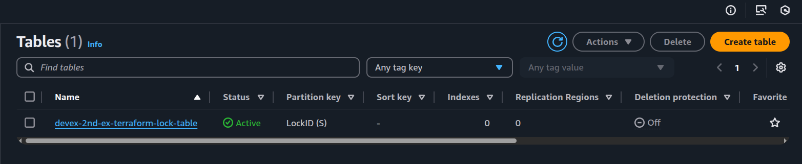

- **S3 buckets (tf state and lambdas)**:  
    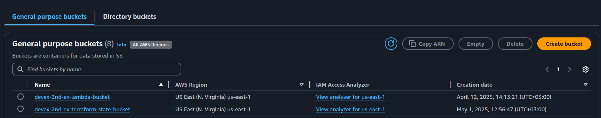

- **EKS cluster**:  
    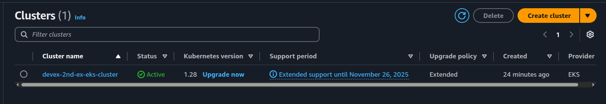

- **EC2 instances**
    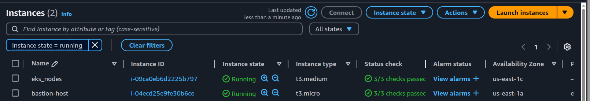

- **Kinesis streams**:  
    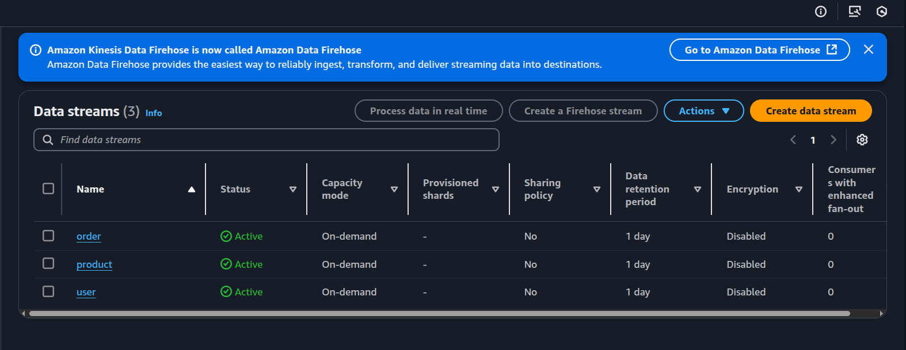

- **Lambda function kinesis trigger**:  
    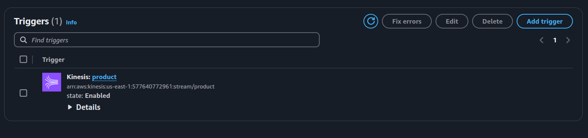

- **Lambda function**:  
    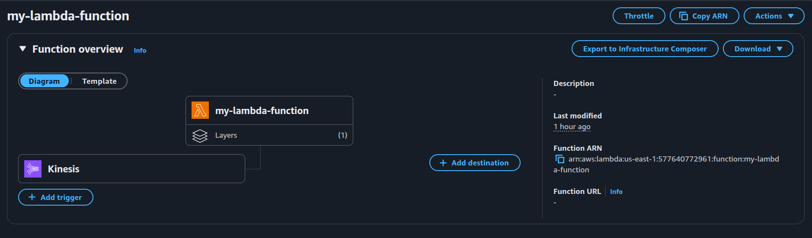

- **RDS (postgres)**:  
    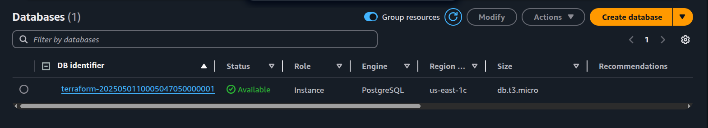


### Test screenshots
- **REST API curl call**
    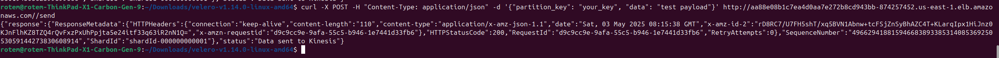

- **Kinesis stream records**
    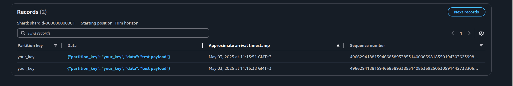

- **Lambda cloud watch logs**
    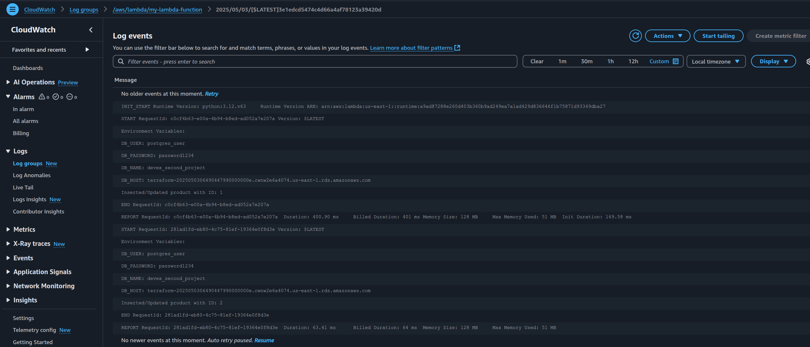

- **RDS DB record written by lambda**
    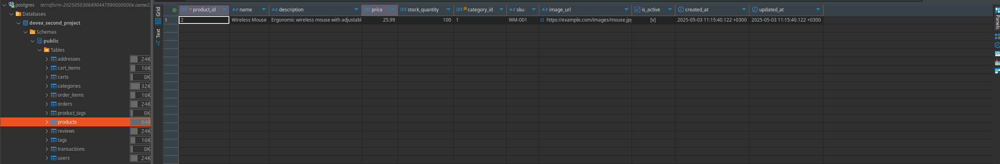


These screenshots provide a visual representation of the resources and their configurations for better understanding and validation.

